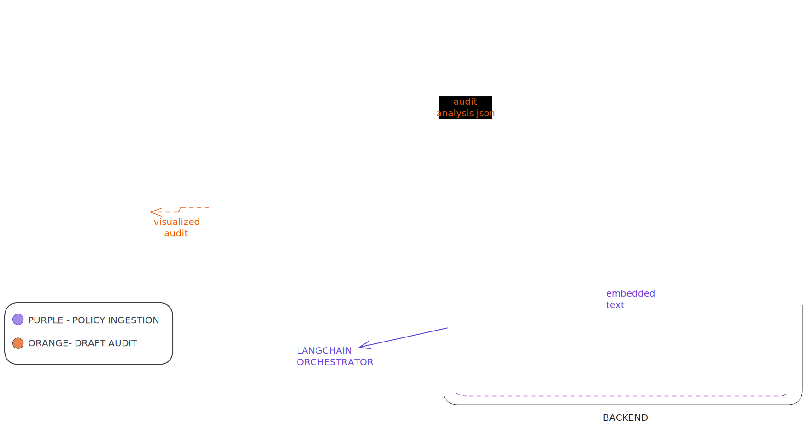

# 🛡️ AI Compliance Auditor (RAG)

[](https://complianceauditor-febypg5bfa4gfr5qtpamga.streamlit.app/)


A robust **Retrieval-Augmented Generation (RAG)** system designed to automate the auditing of corporate communications. The application ingests internal policy documents and uses advanced LLMs to strictly audit user drafts for compliance violations, providing specific rule citations and reasoning.

**[🔴 Live Demo](https://complianceauditor-febypg5bfa4gfr5qtpamga.streamlit.app/)** | **[⚙️ Backend API](https://compliance-auditor.onrender.com/docs)**

---

## 🚀 Key Features

* **📄 Dynamic Policy Ingestion:** Users can upload raw text policy files which are cleaned, chunked, and indexed into a **ChromaDB** vector store in real-time.
* **🤖 Context-Aware Auditing:** Uses **Groq (Llama-3.3-70b)** for high-speed inference, cross-referencing user drafts against indexed policy chunks.
* **⚖️ Quantitative & Logic Checks:** Capable of enforcing specific numerical limits (e.g., "$50 gift limit") and strict procedural rules.
* **📊 Compliance Scoring:** Generates a dynamic compliance score (0-100%) with a breakdown of violations per paragraph.
* **🔗 Microservices Architecture:** Fully decoupled architecture with a **FastAPI** backend (Logic/DB) and **Streamlit** frontend (UI).

---

## 🏗️ Architecture

The system follows a split-stack architecture to ensure separation of concerns and scalability.

  

### **1. Backend (The Engine)**
* **Framework:** FastAPI
* **Hosting:** Render
* **Logic:**
    * **Ingestion:** Splits text into 350-character chunks (overlap 70).
    * **Embeddings:** Google Gemini (`models/gemini-embedding-001`).
    * **Vector Store:** ChromaDB (Ephemeral/In-memory for session).
    * **Inference:** LangChain pipeline connected to `llama-3.3-70b-versatile` via Groq API.

### **2. Frontend (The Interface)**
* **Framework:** Streamlit
* **Hosting:** Streamlit Community Cloud
* **Logic:** Handles file uploads, manages session state, and visualizes the JSON audit results from the API.

---

## 🛠️ Tech Stack

| Component | Technology |
| :--- | :--- |
| **Language** | Python 3.13.2 |
| **Backend Framework** | FastAPI, Uvicorn |
| **Frontend Framework** | Streamlit |
| **LLM Inference** | Groq (Llama-3.3-70b) |
| **Embeddings** | Google Generative AI (Gemini) |
| **Orchestration** | LangChain |
| **Vector DB** | ChromaDB |
| **Deployment** | Render (Backend), Streamlit Cloud (Frontend) |

---

## 💻 Local Installation & Setup

### Prerequisites
* Python **3.13.2**
* API Keys for **Google Gemini** and **Groq Cloud**.

### 1. Clone the Repository
```bash
git clone https://github.com/somoman44/compliance_auditor.git
cd compliance_auditor


Markdown

````

### 2. Backend Setup

Navigate to the backend directory, install dependencies, and start the server.

Bash

```
cd backend
pip install -r requirements.txt
```

Configuration:

Create a .env file in the backend/ folder:

Ini, TOML

```
GOOGLE_API_KEY=your_google_api_key
GROQ_API_KEY=your_groq_api_key
```

**Run Server:**

Bash

```
uvicorn main:app --reload
```

_The backend API will run at `http://localhost:8000`. API Docs available at `http://localhost:8000/docs`._

### 3. Frontend Setup

Open a new terminal, navigate to the frontend directory, and launch the UI.

Bash

```
cd frontend
pip install -r requirements.txt
streamlit run app.py
```

_The web app will open at `http://localhost:8501`._

---

## 📖 Usage Guide

1. **Upload Policy:** On the sidebar, upload a `.txt` file containing your internal rules (e.g., "Employee Code of Conduct").
    
2. **Wait for Indexing:** The system will process and embed the document. You will see a "Policy Active" success message.
    
3. **Draft Text:** Enter the text you wish to audit in the main text area (e.g., an email draft or project proposal).
    
4. **Audit:** Click **Submit**. The system will analyze the draft paragraph-by-paragraph.
    
5. **Review Results:**
    
    - Check the **Compliance Score** gauge.
        
    - Expand specific **Violations** to see the AI's reasoning and the exact policy rule that was broken.
        

---

## 📡 API Endpoints

The Backend exposes the following REST endpoints:

- `POST /policy`: Upload and index a policy text file.
    
- `POST /check_compliance`: specific string analysis against the indexed policy. Returns JSON with violation details.
    
- `POST /delete`: Clears the current policy from memory.
    

---

## 🛡️ License

Distributed under the MIT License. See `LICENSE` for more information.